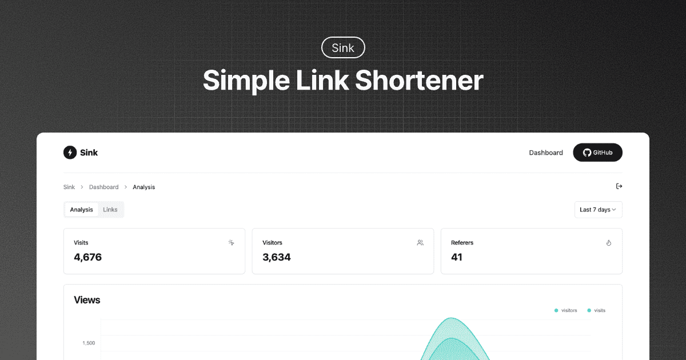
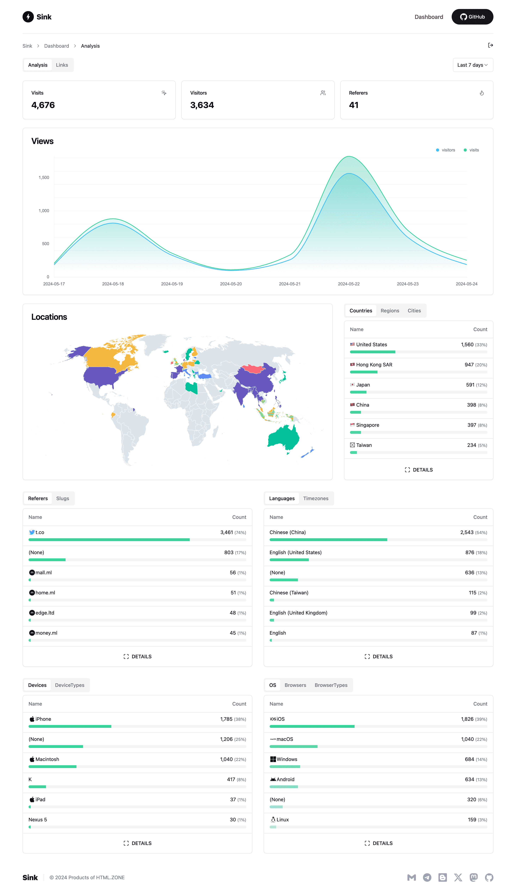
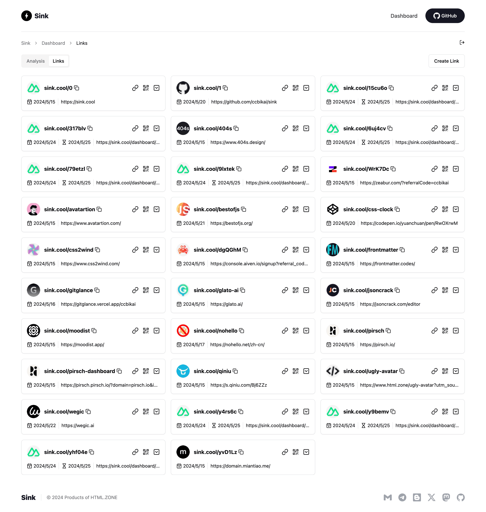
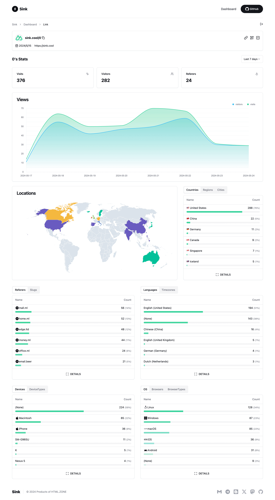

# ⚡ Sink

**A Simple / Speedy / Secure Link Shortener with Analytics, 100% run on Cloudflare.**

----

## ✨ Features

- **URL Shortening:** Compress your URLs to their minimal length.
- **Analytics:** Monitor link analytics and gather insightful statistics.
- **Serverless:** Deploy without the need for traditional servers.
- **Customizable Slug:** Support for personalized slugs and case sensitivity.
- **🪄 AI Slug:** Leverage AI to generate slugs.
- **Link Expiration:** Set expiration dates for your links.

  
<b>Screenshots</b>

  
  
  

## 🧱 Technologies Used

- **Framework**: [Nuxt](https://nuxt.com/)
- **Database**: [Cloudflare Workers KV](https://developers.cloudflare.com/kv/)
- **Analytics Engine**: [Cloudflare Workers Analytics Engine](https://developers.cloudflare.com/analytics/)
- **UI Components**: [Shadcn-vue](https://www.shadcn-vue.com/)
- **Styling:** [Tailwind CSS](https://tailwindcss.com/)
- **Deployment**: [Cloudflare](https://www.cloudflare.com/)

## 🏗️ Deployment
1. [Clone](https://github.com/kencanadev/Sink) the repository to your machine.
2. Create a project in [Cloudflare Pages](https://developers.cloudflare.com/pages/).
3. Select the `Sink` repository and choose the `Nuxt.js` preset.
4. Configure the following environment variables:
   - `NUXT_SITE_TOKEN`: Must be longer than **8** characters. This token grants access to your dashboard.
   - `NUXT_CF_ACCOUNT_ID`: Locate your [account ID](https://developers.cloudflare.com/fundamentals/setup/find-account-and-zone-ids/).
   - `NUXT_CF_API_TOKEN`: Create a [Cloudflare API token](https://developers.cloudflare.com/fundamentals/api/get-started/create-token/) with at least `Account.Account Analytics` permissions. [See reference.](https://developers.cloudflare.com/analytics/analytics-engine/sql-api/#authentication)

5. Save and deploy the project.
6. Cancel the deployment, then navigate to **Settings** -> **Bindings** -> **Add**:
   - **KV Namespace**: Bind the variable name `KV` to a KV namespace (create a new one under **Workers & Pages** -> **KV**).
   - **Workers AI** (_Optional_): Bind the variable name `AI` to the Workers AI Catalog.
   - **Analytics Engine**:
     - In **Workers & Pages**, go to **Account details** on the right side, find `Analytics Engine`, and click `Set up` to enable the free version.
     - Return to **Settings** -> **Bindings** -> **Add** and select **Analytics engine**.
     - Bind the variable name `ANALYTICS` to the `sink` dataset.

7. Redeploy the project.

## ⚒️ Configuration

[Configuration Docs](./docs/configuration.md)

## 🔌 API

[API Docs](./docs/api.md)

## 🙋🏻 FAQs

[FAQs](./docs/faqs.md)

## 💖 Credits

1. [**Cloudflare**](https://www.cloudflare.com/)
2. [**NuxtHub**](https://hub.nuxt.com/)
3. [**Astroship**](https://astroship.web3templates.com/)

